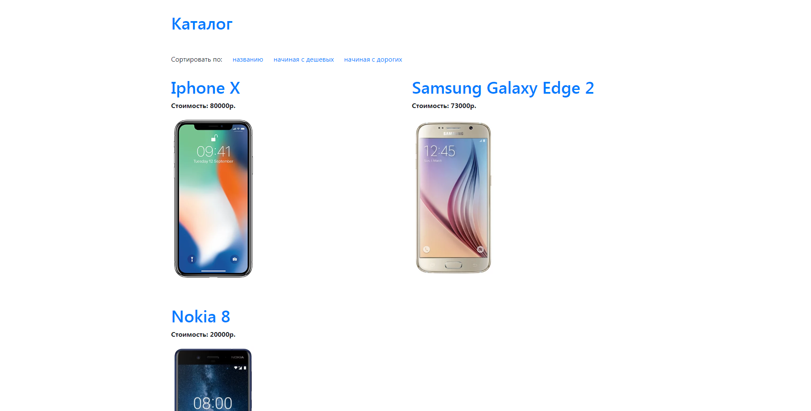

# Выгрузка каталога товаров из csv-файла с сохранением всех позиций в базе данных

## Реализовано

* Модель Phone с полями `id`, `name`, `price`, `image`, `release_date`, `lte_exists` и `slug`. 
* Значение поля `slug` устанавливатеся слагифицированным значением поля `name`.
* Скрипт для переноса данных из csv-файла в модель `Phone`. 
* В каталоге возможно менять порядок отображения товаров: по названию (в алфавитном порядке) и по цене (по-убыванию и по-возрастанию):
  * `<имя_сайта>/catalog?sort=name` - сортировка по названию
  * `<имя_сайта>/catalog?sort=min_price` - сортировка по цене

